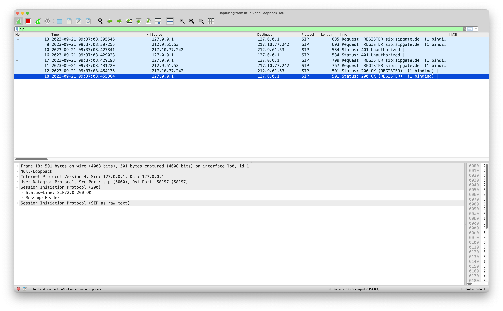

# udpproxy

## Description

This project aims to be a simple UDP proxy server that can be used to forward UDP packets to a different host and port.
It can be used to inspect UDP payloads and modify them on the fly. 

Right now, this is a proof of concept that can be used to connect to sipgate's customer loadbalancers via UDP.
This might serve as a starting point for manipulation of GTPv2 payloads in the future. We need to modify certain
packets on the fly in order to debug our GTPv2 implementation for VoLTE.

## Building and running

### Using docker 
```bash
docker build -t udpproxy .
docker run --rm -ti -p 5060:5060/udp udpproxy
```
### Using maven
```bash
mvn clean package
java -jar target/udpproxy.jar
```

### Testing the proxy with SIP

Configure a local SIP Phone to use these parameters:

Tested with "Telephone" on macOS:
- username: `<your sipgate username>`
- password: `<your sipgate password>`
- domain: `sipgate.de`
- proxy: `localhost`
- proxy port: `5060`
- sip transport: `UDP`
- ip version: `IPv4`

You should be able to make calls now. The proxy will print messages like this to STDOUT:

```
Proxy server listening on /0.0.0.0:5060
Got packet from proxy server client: /192.168.65.1:25840
Got packet from proxy server client: /192.168.65.1:25840
Got packet from proxy server target: /217.10.77.242:5060
Got packet from proxy server client: /192.168.65.1:25840
Got packet from proxy server target: /217.10.77.242:5060
Got packet from proxy server target: /217.10.77.242:5060
```

Using wireshark, you can inspect the SIP packets that are sent to and from the proxy server:


